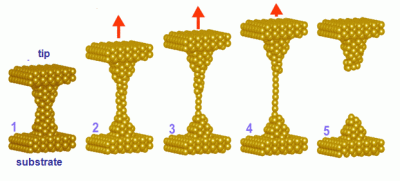
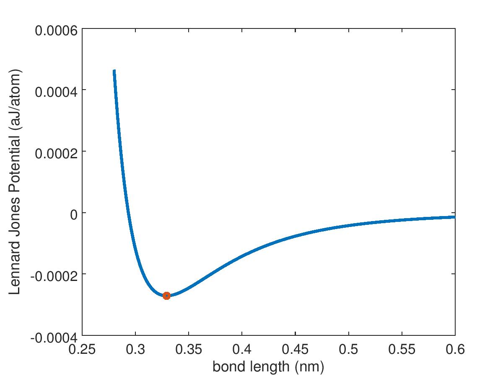
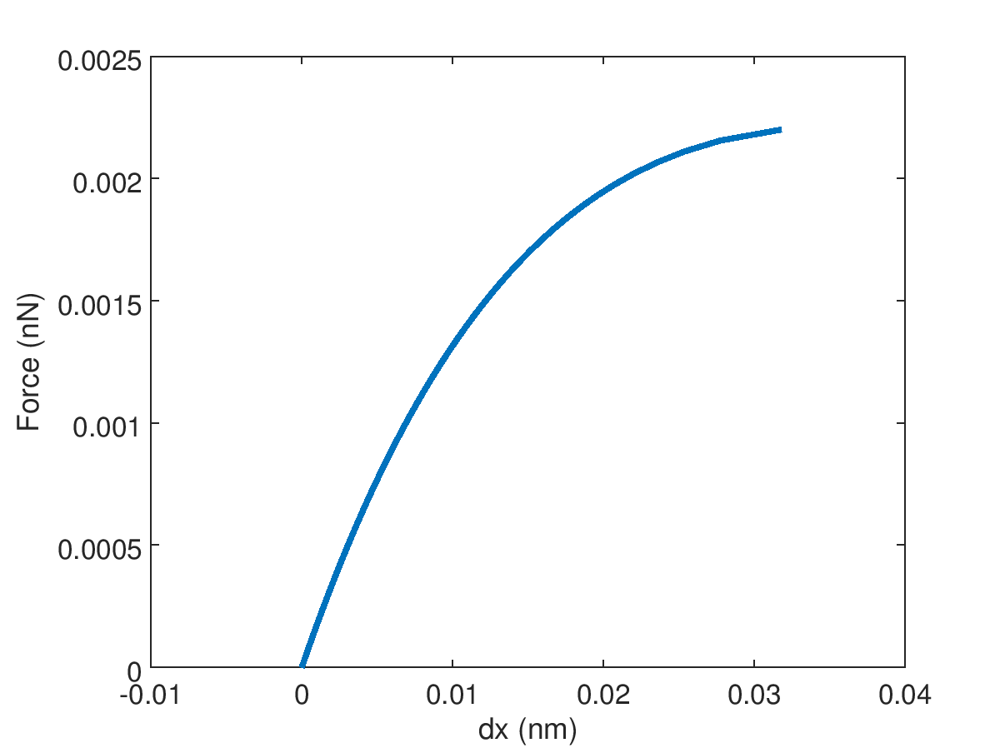

# Roots and Optimization assignment

Demo of uploading assignment

## Solution to Gold Chain nonlinear spring constants




# Homework #3 plots of Gold chain F vs dx and Lennard-Jones Potential

```matlab
epsilon = 0.039; % kcal/mol
epsilon = epsilon*6.9477e-21; % J/atom
epsilon = epsilon*1e18; % aJ/J
% final units for epsilon are aJ

sigma = 2.934; % Angstrom
sigma = sigma*0.10; % nm/Angstrom
x=linspace(2.8,6,200)*0.10; % bond length in um

Ex = lennard_jones(x,sigma,epsilon);

%[Emin,imin]=min(Ex);

[xmin,Emin] = fminbnd(@(x) lennard_jones(x,sigma,epsilon),0.28,0.6)

h1=figure(1)
plot(x,Ex,xmin,Emin,'o')
ylabel('Lennard Jones Potential (aJ/atom)')
xlabel('bond length (nm)')
saveas(h1,'potential_energy.png')

Etotal = @(dx,F) lennard_jones(xmin+dx,sigma,epsilon)-F.*dx;

% Now with xmin determined find F vs dx for gold chain model
% with 50 steps from 0 to 0.0022 nN

N=50;
dx = zeros(1,N); % [in nm]
F_applied=linspace(0,0.0022,N); % [in nN]
for i=1:N
    optmin=goldmin(@(dx) Etotal(dx,F_applied(i)),-0.001,0.035);
    dx(i)=optmin;
end

h2=figure(2)
plot(dx,F_applied)
xlabel('dx (nm)')
ylabel('Force (nN)')
saveas(h2,'force_vs_dx.png')
```

This script in included as `gold_chain_script.m`

Output is two plots, 'potential_energy.png' and 'force_vs_dx.png'




